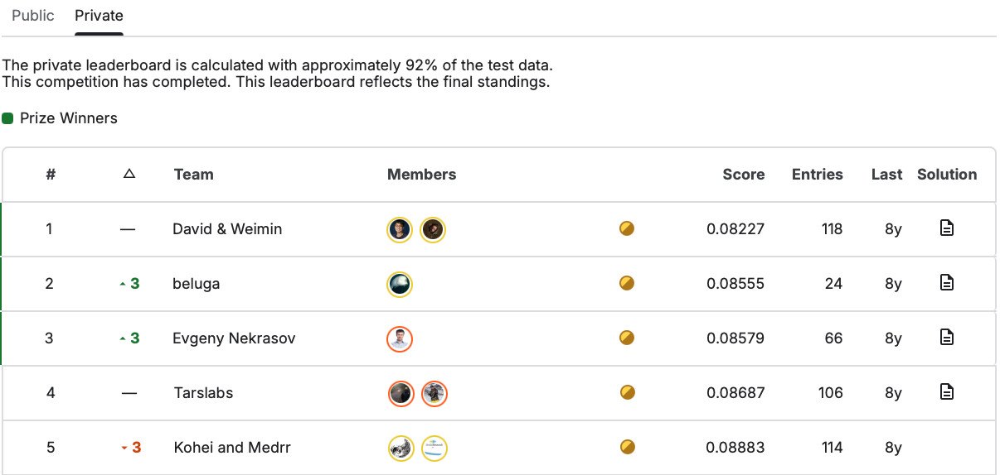
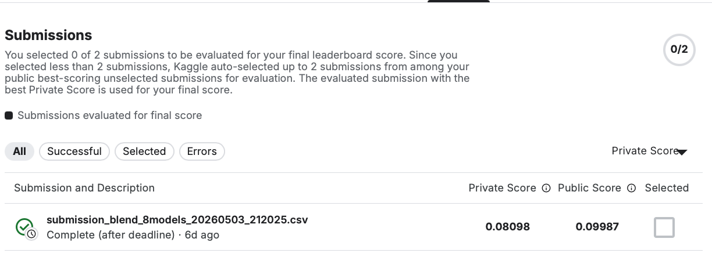

# Multimodal Radar Image Iceberg Classification

**Course:** SDSC/8007 Deep Learning Mini Project  
**Competition:** Statoil/C-CORE Iceberg Classifier Challenge  
**Selected Topic:** Intermediate Task 3, Multimodal Radar Image Iceberg Classification  
**Team Members:** Yang Lin 72540214; Duan Yixuan 72542270  

## Abstract

This project reproduces and improves the Kaggle **Statoil/C-CORE Iceberg Classifier Challenge**, a binary classification task that predicts whether an object in satellite radar imagery is an iceberg or a ship. Each sample contains two Synthetic Aperture Radar (SAR) image bands and an incidence-angle feature, making the task a multimodal classification problem.

We implemented a complete deep learning pipeline following the course requirements: data analysis, leakage-aware validation, baseline construction, CNN model training, model improvement, final result analysis, AI usage disclosure, and reproducibility packaging. Starting from a shallow engineered-feature baseline, we progressively added SAR image CNNs, pseudo-label filtering, pretrained FiLM ResNet34, incidence-angle statistical features, and strict second-stage stacking.

Our final model is a **strict angle-aware stacking ensemble**. The first stage trains multiple CNN image models with 5-fold cross-validation. The second stage combines their out-of-fold predictions with incidence-angle statistical features using LightGBM and Logistic Regression. To reduce validation leakage, when predicting each validation fold, the true labels of that fold are excluded from label-based incidence-angle statistics.

The final Kaggle late submission achieved a private score of `0.08098`. The corresponding local strict 5-fold CV log loss is `0.088556`, below the Top-5-level reference value `0.08883` used in our project comparison. We use the private score as the main official Kaggle result because the private leaderboard covers most of the test set and reflects the final standings.

## Author Contributions

Both team members made equal contributions to this mini-project. Yang Lin and Duan Yixuan jointly contributed to task selection, literature and public-solution review, model design, experiment execution, result analysis, presentation preparation, and final report writing. Therefore, the contribution breakdown is:

| Member | Contribution |
| --- | ---: |
| Yang Lin | 50% |
| Duan Yixuan | 50% |

## 1. Task Description & Metric

The selected competition is the **Statoil/C-CORE Iceberg Classifier Challenge**. The goal is to classify objects in satellite SAR images as either iceberg or ship. Each sample contains:

| Field | Description |
| --- | --- |
| `band_1` | First SAR image band, flattened from a `75 x 75` image |
| `band_2` | Second SAR image band, also flattened from a `75 x 75` image |
| `inc_angle` | Radar incidence angle, provided as a numerical metadata feature |
| `is_iceberg` | Binary target label; 1 indicates iceberg and 0 indicates ship |

This is a binary classification task with multimodal inputs. It is more challenging than standard natural-image classification because SAR images represent radar backscatter rather than RGB color and texture. The task matches the course's Intermediate Task 3, which emphasizes non-natural images, multimodal fusion, and noise/robustness analysis.

The official evaluation metric is **binary log loss**:

```text
LogLoss = -1/N * sum_i [ y_i log(p_i) + (1-y_i) log(1-p_i) ]
```

where `y_i` is the true label and `p_i` is the predicted probability that the sample is an iceberg. Lower log loss is better. Since log loss heavily penalizes overconfident wrong predictions, the model must output calibrated probabilities rather than only correct class labels.

Kaggle late submission is available for this competition. We therefore report the official Kaggle private score as the main submission result, while also reporting a strict 5-fold CV score to document the validation protocol and reproducibility. The public score is shown only as supplementary information because the public split is smaller and less representative of final standings.

## 2. Data Analysis & Challenges

The training set contains `1604` labeled samples, and the test set contains `8424` samples. Each sample has two SAR bands of size `75 x 75`. There are `133` missing incidence-angle values in the training set and no missing incidence-angle values in the test set. The training labels are only mildly imbalanced: `851` ship samples and `753` iceberg samples, corresponding to approximately `53.1%` ship and `46.9%` iceberg.

Our cache-building script reports:

```text
train images: (1604, 2, 75, 75), labels: (1604,)
test images:  (8424, 2, 75, 75)
train missing incidence angles: 133
test missing incidence angles: 0
test real-like inc_angle decimals <= 4: 3424
test synthetic-like inc_angle decimals > 4: 5000
```

The main challenges are:

1. **Non-natural SAR imagery.** SAR images measure radar backscatter rather than visible-light appearance. They contain speckle-like noise and have very different statistics from standard RGB images.

2. **Small training set.** Only 1604 labeled samples are available, so deep CNNs can overfit easily without careful validation, regularization, data augmentation, and ensembling.

3. **Multimodal structure.** The target depends on both image morphology and incidence angle. The incidence angle affects radar reflection and also contains strong dataset-level statistical patterns.

4. **Machine-generated test rows.** Public discussions reported that the test set contains generated rows. We preserved the raw `inc_angle` string and computed its decimal precision. In our audit, `3424` test rows have `angle_decimals <= 4`, while `5000` rows have `angle_decimals > 4`. This information is used as a filtering signal for pseudo-labeling and angle-neighborhood statistics.

5. **Public/private instability.** The public leaderboard uses only part of the test labels. For this competition, public and private scores can differ noticeably, so we treat the private score as the main Kaggle evidence and use strict CV as a reproducibility check.

## 3. Validation Strategy

We use a two-layer validation strategy: first-stage validation for CNN image models and second-stage validation for angle-aware stacking.

### 3.1 First-stage CNN validation

All first-stage CNN models are trained using stratified 5-fold cross-validation:

| Setting | Value |
| --- | --- |
| Number of folds | 5 |
| Shuffle | True |
| Random seed | 2026 |
| Split strategy | Stratified by `is_iceberg` |
| Metric | Binary log loss |

For each fold, image normalization and incidence-angle normalization are fitted only on the training portion of that fold, then applied to the validation portion and test set. This prevents validation statistics from entering the training process.

### 3.2 Strict second-stage stacking validation

The second stage uses first-stage out-of-fold predictions and incidence-angle-derived statistical features. The central leakage-control rule is:

> When predicting a validation fold, the true labels of that validation fold are not used to construct label-based incidence-angle statistics for that fold.

For example, when fold 0 is used as validation, statistics such as the iceberg rate of samples with the same or nearby incidence angle are computed only from folds 1-4. The model can use unlabeled `inc_angle` values from train and test as input metadata, but it cannot use validation-fold labels when constructing label-based features.

### 3.3 Leakage-control summary

| Potential risk | Control measure |
| --- | --- |
| Image normalization fitted with validation statistics | Fit normalization only on the training split of each fold |
| Incidence-angle scaler fitted with validation statistics | Fit the angle scaler only on the training split |
| Label-based angle statistics leaking validation labels | Exclude the current validation fold's labels in strict stacking |
| Pseudo-label noise from synthetic-like test rows | Use only high-confidence pseudo labels and filter by raw `inc_angle` decimal precision |
| Overconfident probabilities under log loss | Clip final probabilities and optimize blend weights on out-of-fold predictions |

Base C uses pseudo-labeling. It does not use any test-set true labels, but it does use unlabeled test inputs and teacher-model predictions. We therefore disclose it as a semi-supervised / transductive training strategy.

## 4. Baseline Model

The baseline model is designed to be simple, reproducible, and interpretable. We compute image statistics for each SAR channel, including mean, standard deviation, minimum, maximum, and percentile values. These features are combined with `inc_angle` and a missing-angle indicator, then trained using Logistic Regression and ExtraTrees. Their out-of-fold predictions are blended.

| Model | Validation setup | Log loss |
| --- | --- | ---: |
| Logistic Regression + ExtraTrees blend | 5-fold CV | 0.3403 |

This baseline verifies that data loading, label alignment, fold splitting, and log-loss computation are correct. It also shows that global image statistics alone are not sufficient for Top-5-level performance.

## 5. Model Improvements

### 5.1 SAR image channel construction

The original input contains two SAR image bands. We construct a 4-channel dB-space input:

```text
channel 1 = band_1
channel 2 = band_2
channel 3 = (band_1 + band_2) / 2
channel 4 = band_1 - band_2
```

The first two channels preserve the raw SAR bands, the third channel represents average radar intensity, and the fourth channel captures polarization contrast. Channel-wise normalization is computed within each fold using only the training split.

### 5.2 First-stage image models

We train four first-stage model families:

| Model | Method | Purpose |
| --- | --- | --- |
| Base A | Compact residual-style CNN with 4-channel dB input and an angle auxiliary branch | Stable image baseline |
| Base B | VGG-style CNN with batch normalization and dropout | Architectural diversity |
| Base C | CNN trained with filtered high-confidence pseudo labels from Base A | Semi-supervised signal expansion |
| Base D | ImageNet-pretrained ResNet34 with FiLM angle modulation | Pretrained representation and physical angle conditioning |

All models use rotations, flips, small Gaussian noise, early stopping, and test-time augmentation. The purpose of the first stage is not to make one CNN solve the task alone, but to generate diverse and stable out-of-fold predictions for the second-stage model.

### 5.3 Training settings and hyperparameter tuning

Hyperparameter tuning focused on stable validation performance rather than maximizing training-set fit. The main settings used in the final reproduction script are summarized below.

| Component | Main hyperparameters and tuning choices |
| --- | --- |
| Base A / Base C CNN | AdamW optimizer, learning rate `0.001`, weight decay `1e-4`, batch size `64`, epoch limit `120`, early-stopping patience `25`, width `48`, dropout `0.20` |
| Base B VGG-style CNN | AdamW optimizer, learning rate `0.001`, weight decay `1e-4`, batch size `64`, epoch limit `120`, early-stopping patience `25`, width `48`, dropout `0.30` |
| Base D FiLM ResNet34 | AdamW optimizer, learning rate `0.0003`, weight decay `1e-4`, batch size `32`, epoch limit `80`, early-stopping patience `15`, dropout `0.30` |
| Learning schedule and loss | Cosine annealing learning-rate schedule; binary cross-entropy with logits; validation metric is binary log loss |
| Augmentation and inference | Rotations, flips, small Gaussian noise during training; test-time augmentation for first-stage CNN predictions |
| Pseudo-label filtering | High-confidence test predictions only: probability `<=0.03` or `>=0.97`, pseudo-label weight `0.35`, with raw `inc_angle` decimal-precision filtering |
| LightGBM stacking | 4 seeds: `2026-2029`; max depth `3`, `70` estimators, learning rate `0.1`, min child samples `40`, subsample `0.95`, column sample `0.70` |
| Logistic stacking | StandardScaler + Logistic Regression; `C=0.2`, max iterations `5000`, seeds `2026-2029` |
| Final blend | Non-negative weights constrained to sum to 1, optimized on out-of-fold predictions using binary log loss |

For readability, these settings can be viewed as two groups. The first group controls CNN training (optimizer, learning rate, batch size, early stopping, dropout, augmentation, and test-time augmentation). The second group controls pseudo-label filtering, LightGBM stacking, Logistic Regression stacking, and final non-negative blending.

### 5.4 Pretrained model usage

Base D uses the official PyTorch ResNet34 ImageNet checkpoint:

```text
https://download.pytorch.org/models/resnet34-b627a593.pth
```

ResNet34 has approximately 21-22 million parameters, which is far below the course limit of 0.5B parameters. Since SAR inputs are not RGB images, the first convolution is modified from 3 input channels to 4 input channels. The first three channels are initialized from the pretrained RGB weights, while the fourth channel is initialized by averaging the RGB weights. We then add a FiLM module that uses `inc_angle` to generate feature-wise scale and shift parameters for the CNN feature map.

Ensembling is used in the final system: Base D is one first-stage model family inside the broader 8-model strict stacking blend. No other external pretrained backbones are used.

### 5.5 Incidence-angle statistical features and stacking

Public top-solution discussions show that `inc_angle` contains strong group and neighborhood patterns. We do not copy public notebooks. Instead, we reimplement the idea with a stricter validation rule that excludes validation-fold labels.

The second-stage feature set includes:

- predictions from the four first-stage CNN models;
- mean, median, minimum, maximum, range, and standard deviation of CNN predictions;
- raw `inc_angle` value;
- missing-angle indicator;
- raw JSON decimal precision of `inc_angle`;
- prediction statistics for identical or rounded incidence angles;
- KNN neighborhood statistics in incidence-angle space;
- radius-neighborhood statistics in incidence-angle space;
- label-based angle statistics computed under the strict fold rule.

The second-stage ensemble contains:

```text
4 LightGBM stacking models, seeds = 2026, 2027, 2028, 2029
4 Logistic Regression stacking models, seeds = 2026, 2027, 2028, 2029
```

Their out-of-fold predictions are combined using non-negative weight optimization. The final model is an 8-model strict stacking blend.

### 5.6 Comparative evidence

| Stage | Main method | Log loss |
| --- | --- | ---: |
| Baseline | Image statistics + `inc_angle` + traditional models | 0.3403 |
| CNN/image ensemble | Multiple CNN image models | 0.1788 |
| Strict angle-aware stacking | CNN predictions + strict `inc_angle` statistics + LightGBM/LogReg blend | 0.088556 |

This is a stage-level ablation. Removing the first-stage CNN image models leaves only the shallow engineered-feature baseline at `0.3403`. Removing the second-stage angle-aware stacking keeps the CNN/image ensemble at `0.1788`. Adding strict incidence-angle statistical features and the LightGBM/LogReg stacking blend reduces the local strict CV log loss to `0.088556`. We did not rerun every possible Base A/B/C/D component-level ablation due to time and GPU constraints; this remains a limitation discussed in Section 8.

## 6. Final Results

### 6.1 Local strict CV result

The final strict 8-model blend achieves:

```text
Strict 5-fold CV log loss = 0.088556
```

This is below the Top-5-level reference value `0.08883` used in our project comparison.

### 6.2 Kaggle late-submission result

The final main submission file is:

```text
submission_blend_8models_20260503_212025.csv
```

Kaggle late-submission score:

| Submission | Private Score |
| --- | ---: |
| `submission_blend_8models_20260503_212025.csv` | **0.08098** |





Because public/private instability is substantial in this competition, the private score is the main Kaggle evidence. Under the same private leaderboard metric, our late-submission private score of `0.08098` is lower than the fifth-place private score of `0.08883` shown in the leaderboard screenshot. Therefore, although the late submission may not change the historical official ranking, the achieved private score meets the course's Top-5-level performance target.

## 7. AI Tool Usage Statement

We used ChatGPT (OpenAI) as the primary AI assistant during this project, and DeepSeek was used occasionally for cross-checking modeling ideas and risk analysis. These tools were used as assistants, not as authoritative sources. They were not used to directly submit an unverified complete solution.

The usage was limited to:

1. **Debugging and error diagnosis.** AI helped diagnose Python, PyTorch, CUDA/GPU, dependency, server-path, and shell-script errors.
2. **Technical explanation and idea discussion.** AI helped explain public discussion ideas such as incidence-angle statistics, stacking, pseudo-labeling, and FiLM, and helped analyze their applicability and leakage risks.
3. **Code review and reproducibility checks.** AI helped review selected code snippets and inspect the cross-validation protocol, pseudo-label filtering, second-stage stacking, README, and one-command reproduction script. All core implementation was written, tested, and verified by the group.
4. **Report organization and language polishing.** AI helped organize the report and polish the wording, while all reported experimental results, Kaggle scores, method choices, and limitations were checked by the group.

We did not directly copy or lightly modify public Kaggle notebooks, and we did not submit results without group verification. Public discussions were used only as references for general modeling ideas. The group reviewed and verified the data pipeline, model training, cross-validation, strict stacking, final blending, reproduction scripts, and reported Kaggle results for this project.

Core designs independently confirmed by the group include:

- binary log-loss evaluation and 5-fold CV setup;
- SAR channel construction and fold-safe normalization;
- first-stage CNN training configuration;
- strict angle-aware stacking with validation-fold label exclusion;
- filtered pseudo-labeling and its semi-supervised / transductive nature;
- source, parameter count, and structure of pretrained ResNet34 + FiLM;
- final Kaggle late submission and reproduction workflow.

## 8. Discussion & Reflection

The experiments show that training a deeper CNN alone is not sufficient for this task. The shallow baseline obtains `0.3403` log loss. CNN image models improve the result to around `0.1788`, confirming that SAR image morphology is useful. The final major improvement comes from combining image predictions with strict incidence-angle statistical features, reducing local CV log loss to `0.088556` and Kaggle private score to `0.08098`.

Effective components include:

- fold-safe CNN training and test-time augmentation;
- multiple first-stage image models rather than a single CNN;
- explicit incidence-angle group and neighborhood features;
- second-stage validation that excludes current validation-fold labels;
- LightGBM and Logistic Regression blending for stable probability estimates.

Limitations remain:

- The incidence-angle pattern is dataset-specific and may not generalize to a new radar acquisition process.
- Base C uses test inputs and teacher predictions for pseudo-labeling, so it should be disclosed as semi-supervised / transductive training.
- Final blend weights are optimized on out-of-fold predictions and may contain mild model-selection bias.
- CNN retraining can vary slightly across CUDA/PyTorch environments even with fixed seeds.

Future work could include a no-pseudo-label ablation, systematic SAR speckle-noise filtering, nested validation for blend-weight selection, and deeper public/private score analysis.

## 9. Reproducibility

### 9.1 Code package

The reproduction package is:

```text
SDSC8007_Iceberg_Classifier_Repro.zip
```

The public GitHub repository for the same code package is:

```text
https://github.com/mayday4yl/SDSC8007-Iceberg-Classifier
```

The project is script-based rather than notebook-based, so no separate notebooks are required to reproduce the result. It does not include Kaggle raw data, old experiment outputs, or model weights. To reproduce, place the Kaggle files in:

```text
data/processed/train.json
data/processed/test.json
data/processed/sample_submission.csv
```

### 9.2 Environment

The final reproduction environment was:

| Item | Configuration |
| --- | --- |
| GPU | NVIDIA GeForce RTX 4090 24GB |
| CUDA | 12.8 |
| Driver | 570.124.06 |
| Python | 3.12 |
| PyTorch | 2.6.0a0+ecf3bae40a.nv25.01 |
| Seed | 2026 |

Python dependencies are listed in `requirements.txt`. PyTorch and torchvision should be installed using a CUDA-compatible build for the target machine.

### 9.3 One-command reproduction

After placing the Kaggle data files under `data/processed/`, run:

```bash
cd /path/to/SDSC8007_Iceberg_Classifier_Repro
python -m pip install -U pip
python -m pip install -r requirements.txt
PYTHON_BIN=python bash scripts/run_from_scratch.sh
```

The script creates a timestamped output directory:

```text
artifacts/from_scratch_<timestamp>/
  run.log
  predictions/
  reports/
  models/
```

Key outputs include:

```text
predictions/submission_blend_8models_*.csv
predictions/oof_blend_8models_*.csv
reports/metrics_blend_8models_*.json
run.log
```

The Kaggle submission CSV is a generated output. The file submitted for late submission was named `submission_blend_8models_20260503_212025.csv`; the filename itself does not affect Kaggle scoring, but we keep the original name in the report so it matches the Kaggle submission record.

The final CV score can be recomputed from the generated OOF file using the verification script in the `scripts` directory.

## References

1. Kaggle. Statoil/C-CORE Iceberg Classifier Challenge. https://www.kaggle.com/competitions/statoil-iceberg-classifier-challenge
2. David Austin. 1st Place Solution Overview. Kaggle Discussion 48241. https://www.kaggle.com/competitions/statoil-iceberg-classifier-challenge/discussion/48241
3. beluga. 2nd Place Solution Overview. Kaggle Discussion 48294. https://www.kaggle.com/competitions/statoil-iceberg-classifier-challenge/discussion/48294
4. Evgeny Nekrasov. 3rd-Place Solution Overview. Kaggle Discussion 48207. https://www.kaggle.com/competitions/statoil-iceberg-classifier-challenge/discussion/48207
5. Andrii Sydorchuk. 4th Place Approach. Kaggle Discussion 48163. https://www.kaggle.com/competitions/statoil-iceberg-classifier-challenge/discussion/48163
6. Azat Akhtyamov. 6th Place Solution. Kaggle Discussion 48193. https://www.kaggle.com/competitions/statoil-iceberg-classifier-challenge/discussion/48193
7. PyTorch. ResNet34 ImageNet pretrained weights. https://download.pytorch.org/models/resnet34-b627a593.pth
